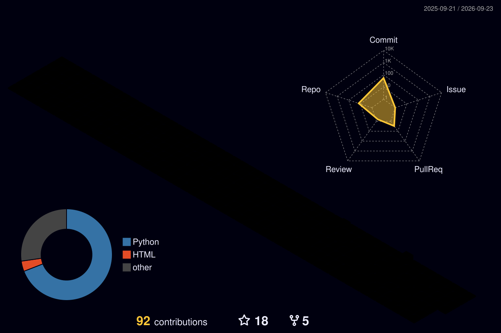

  

  

  

### 🚀 About Me

just a Tech who loves coding and learns continuously some one who eats problems  with delicious desserts (?) studied computer engineering  but so what ?

🔭 &nbsp;I'm currently working on **personal projects**  
🌱 &nbsp;I'm currently learning **FAST API &amp;DATA SCIENCE**  
😄 &nbsp;Pronouns: **she**  
⚡ &nbsp;Fun fact: **every night I'm dreaming about coding and debugging 🙃**

### 🛠️ Tech Stack

  
  
  
  
  
  
  
  
  
  
  
  
  
  
  

### 🔗 Connect With Me

  
  

### 📊 GitHub Stats

  
  

### 📈 Contribution Graph

### 💭 Dev Quote

  

---

<i>⭐️ From <a href="https://github.com/helishia20">helishia20</a></i>

